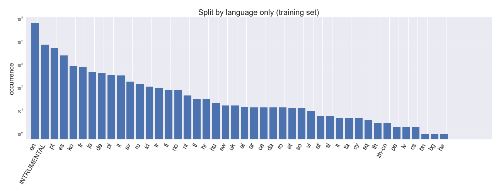
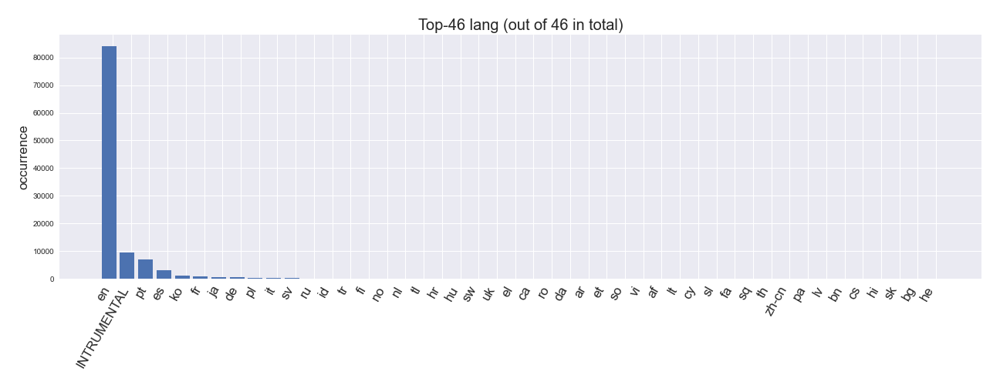
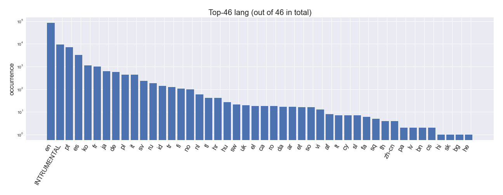
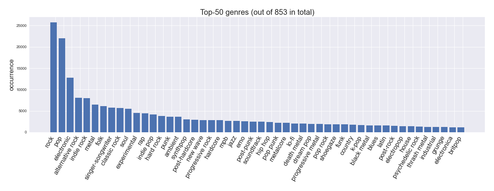
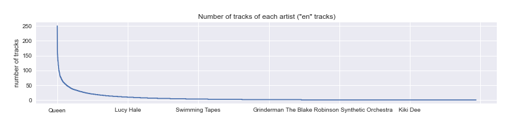
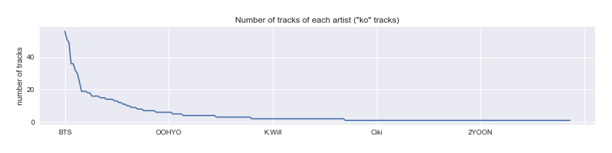
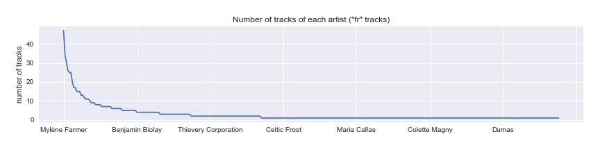
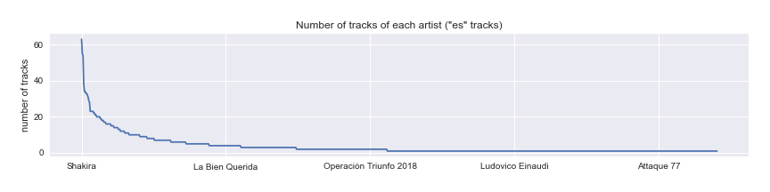

# music4all_contrib

Written by [Keunwoo Choi](https://keunwoochoi.github.io/)

This is **NOT** official music4all dataset repository.

[Music4All](https://sites.google.com/view/contact4music4all) is a dataset for music information retrieval and music recommendation research. 
It comes with a user-based split for recommendation research. However, there's no official track-level split so I decided to share my own one.

There are several types of attributes and labels in the dataset. I am mainly interested in labels -- genres, tags, and languages.
- Language: 46-class single-label classification
- Tag: multi-label, 19,541 classes
- Genre: multi-label, 853 classes

I used [`scikit-multilearn`](http://scikit.ml/api/skmultilearn.model_selection.iterative_stratification.html#module-skmultilearn.model_selection.iterative_stratification)
for multi-label stratification and scikit-learn (with some customization) for single-label stratification.

## Training-Testing Split

Each folder has a single, primary 80:20 split.

 - For tags and genres, use `split-all_labels`. When using this, the language distribution is also pretty well stratified, but there is an artist leakage and it may lead to inflate the languag evaluation.
 - For language classification, use `split-language_only-artist_grouped`. If this is used for tag and genre classification, the evaluation of each class would be biased.  
 - Do not use `split-language_only-DO-NOT-USE-THIS` because it has an artist leakage.  

### `split-all_labels`

[Split is here (text files of the track indices)](split-all_labels/)

This split is a stratification result based on all the labels (language, tag, genre). 
I merged all the labels (19541 + 853 + 46 = 20440) and performed stratification using scikit-multilearn.
The result is as below (up to top 2000 labels only).
See the distributions of training set (top) and testing set (bottom).

Out of 22400 labels, I recommend to consider top-500 labels (13 language, 321 tag, 166 genre labels) due to the data scarcity. 
(More details at in the [notebook](notebooks/)) 

### `split-language_only-artist_grouped`

[Split is here (text files of the track indices)](split-language_only-artist_grouped/)

This split is a stratification result based on language labels only. 
I used a forked/customized class `StratifiedGroupKFold` as you can se in the [artist-grouped stratification notebook](notebooks/artist-grouped-stratified-split.ipynb).
See the distributions of training set (top) and testing set (bottom).

Note that in the testing set, there is no item with language labels: `{'pa', 'lv', 'he', 'cs', 'bg'}`.

## Few more plots

### Occurrence counts of tag labels

### Occurrence counts of language labels

Same, but with log y-axis:

### Occurrence counts of genre labels

## Why grouped-stratification matters?

See this distribution, number of tracks by artist in `en`glish. 

For example, with enough tracks of Queen, the model may learn something that is not about English but about Queen and use the information to classify language.
This may or may not be useful for a real-world application. But, it adds some unmeasurable amount of noise to the evaluation so we would want to avoid here.

Same thing goes for other languages. We would like the model to be about Korean language instead of overfitting to BTS. 

French 
 

Spanish

More pics in [`figures/`](figures/).

## Notes
- Seems like some of the tags are just identical to genre labels 
(e.g., the occurrence counts of the top 2 genres, `rock` and `pop`, are equal to those of the top 2 tags, `rock` and `pop`.)
- The stratification process and other analysis is in [notebook](notebooks/). 
  - You'll need to download the dataset and put csv files to `id_csvs/` to run the notebook. 
