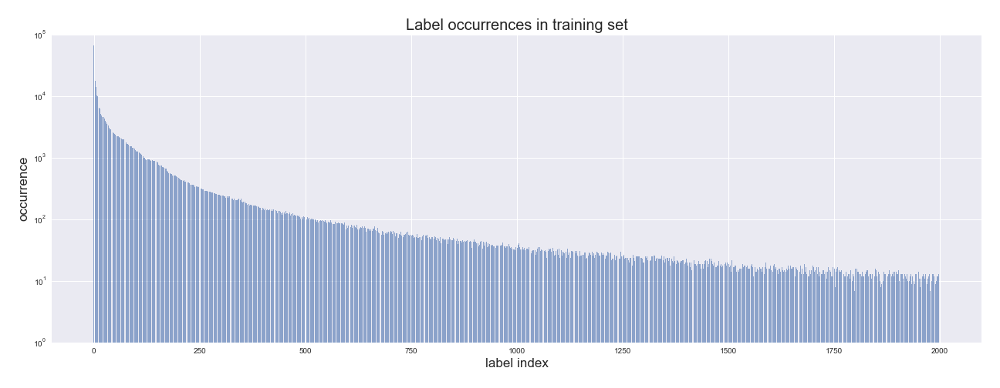
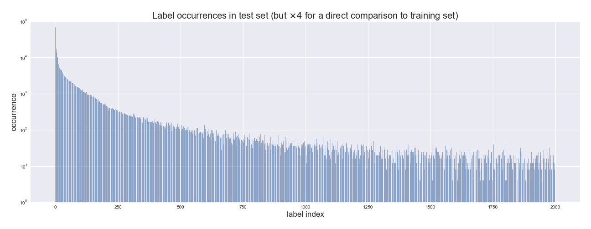
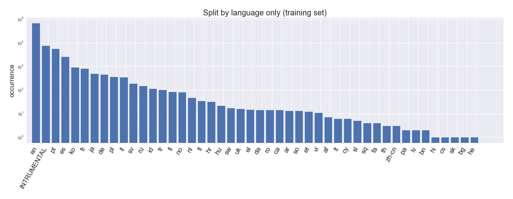
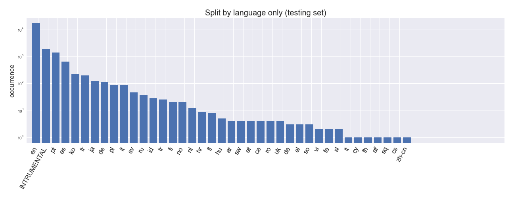
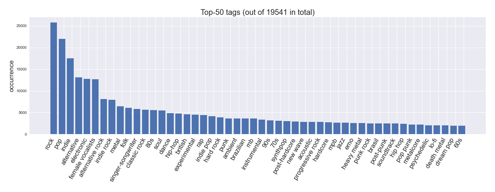

# music4all_contrib

Written by [Keunwoo Choi](https://keunwoochoi.github.io/)

This is **NOT** official music4all dataset repository.

[Music4All](https://sites.google.com/view/contact4music4all) is a dataset for music information retrieval and music recommendation research. 
It comes with a user-based split for recommendation research. However, there's no official track-level split so I decided to share my own one.

There are several types of attributes and labels in the dataset. I am mainly interested in labels -- genres, tags, and languages.
- Language: 46-class single-label classification
- Tag: multi-label, 19,541 classes
- Genre: multi-label, 853 classes

I used [`scikit-multilearn`](http://scikit.ml/api/skmultilearn.model_selection.iterative_stratification.html#module-skmultilearn.model_selection.iterative_stratification)
for multi-label stratification and scikit-learn for single-label stratification.

## Training-Testing Split
I made two splits -- `split-all_labels` and `split-language_only`. Each has only one primary 80:20 split.  

### `split-all_labels`

[Split is here (text files of the track indices)](split-all_labels/)

This split is a stratification based on all the labels (language, tag, genre). 
I merged all the labels (19541 + 853 + 46 = 20440) and performed stratification using scikit-multilearn.
The result is as below (up to top 2000 labels only).
See the distributions of training set (top) and testing set (bottom).

Out of 22400 labels, I recommend to consider top-500 labels (13 language, 321 tag, 166 genre labels) due to the data scarcity. 
(More details at in the [notebook](notebooks/)) 

### `split-language_only`

[Split is here (text files of the track indices)](split-language_only/)

This split is a stratification based on language labels only. It is single-label so I used `sklearn.model_selection.StratifiedKFold`.
See the distributions of training set (top) and testing set (bottom).

Note that in the testing set, there is no item with `{'hi', 'lv', 'bn', 'bg', 'sk', 'pa', 'he'}`.

## Few more plots

### Occurrence counts of tag labels

### Occurrence counts of language labels

Same, but with log y-axis:

### Occurrence counts of genre labels

## Notes
- Seems like some of the tags are just identical to genre labels 
(e.g., the occurrence counts of the top 2 genres, `rock` and `pop`, are equal to those of the top 2 tags, `rock` and `pop`.)
- The stratification process and other analysis is in [notebook](notebooks/). 
  - You'll need to download the dataset and put csv files to `id_csvs/` to run the notebook. 
